# Object Oriented Analysis

## Systemidee
### Intro

Pingu Finance ist ein Finanz-Tool, das von Consultants genutzt wird, um Währungstransaktionen ihrer Kunden einfach und übersichtlich zu verwalten. Die Software bietet einen schnellen Zugriff auf feste Wechselkurse, einen integrierten Währungsumrechner sowie die Möglichkeit, Transaktionen der Kunden zu erfassen, zu bearbeiten und mit verschiedenen Filtern auszuwerten.

---

Pingu-Finance bietet folgende Features:

- Aktuelle Währungskurse der letzten 24 Stunden einsehen
- Mit einem integrierten Rechner Währungen umrechnen
- Währungstransaktionen speichern, einsehen, bearbeiten und filtern

---

In der Software können folgende Daten eingesehen, modifiziert und gefiltert werden:

- Consultant, der den Eintrag erstellt oder modifiziert hat
- Kunde, der die Transaktion ausgeführt hat
- Ausführungsdatum
- Start- und Zielbetrag
- Transaktions-Status: Nicht gestartet, Ausgeführt, Abgeschlossen, Abgebrochen
- Statische Währungskurse die einmal täglich aktualisiert werden

---

Weitere wichtige Eigenschaften von Pingu Finance:

- Sicheres Login- und Registrationsverfahren
- Verschlüsselte Datenhaltung in der Schweiz
- Anzeige von verschiedenen Auswertungen, Berichten und Statistiken
- Einfache und intuitive Bedienung der Benutzeroberfläche

---

### Systemanforderungen

Pingu Finance setzt als einzige Systemanforderungen ein Betriebssystem voraus.

### Abgrenzung

Nicht Bestandteil der initialen Version sind mobile Apps, Webapplikationen, externe API‑Integrationen zu Bank‑ oder Buchhaltungssystemen sowie KI‑basierte Prognose‑ oder Analysefunktionen. Diese können in späteren Versionen ergänzt werden.

### Kosten

Die einmaligen Kosten für die Anschaffung belaufen sich auf 3000 CHF. Nach der Anschaffung werden weitere Kosten für Wartung und Betrieb in der Höhe von 2000 CHF pro Monat erhoben. Ein erste Version der Software (MVP) soll per Januar 2026 bereitstehen.

## Stakeholder-Analyse
| **Stakeholder** | **Risiko** | **Aufwand** | **Priorität** | **Prioritätsgruppen** | Kategorie | Ansprechperson | Einbezug |
| --- | --- | --- | --- | --- | --- | --- | --- |
| Auftraggeber | 6 | 2 | 6.3 | Muss | Anforderungsverantwortliche | Dominic Merz | Interview |
| Superuser Consultant | 4 | 3 | 5 | Muss | Fachexperte | Hans Hagel | Interview |
| 10 Consultants | 2 | 5 | 5.4 | Muss | Systembetroffene | Hans Hagel | Interview |
| Kunde | 1 | 5 | 5.1 | Muss | Systembetroffene | Abdul Al Fatuf | Information |
| 2 Pingu Entwickler | 2 | 4 | 4.5 | Sollte | Anforderungsverantwortliche | Nick Sohl | Aktive Mitarbeit |
| 1 Pingu PO | 4 | 3 | 5 | Muss | Anforderungsverantwortliche | Stefan Furrer | Begutachtung |
| Gesetzgeber | 5 | 5 | 7.1 | Muss | Anforderungsverantwortliche | EDÖB | Information |
---
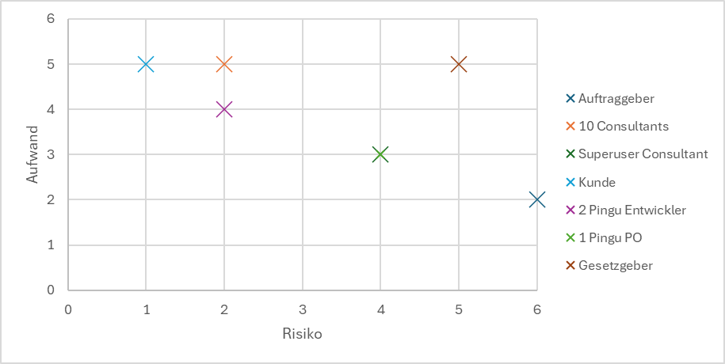
---
### Stakeholder-Interessen-Analyse
| Stakeholder | Interesse / Ziel | Must-have (System muss…) | No-Go / Befürchtungen |
| --- | --- | --- | --- |
| Auftraggeber | Geschäftlicher Nutzen, effiziente Prozesse | Korrekte Umrechnungen, rechtliche Konformität, produktiv einsetzbar | Falsche Berechnungen, Budget-/Zeitüberschreitung |
| Superuser Consultant | Fachliche Unterstützung, Effizienz | Einfache Bedienung, Abdeckung von Spezialfällen | Umständliche Nutzung, fachliche Fehler |
| Consultants (10) | Schnelle tägliche Arbeit | Intuitive UI, verlässliche Ergebnisse | Zeitverlust, hoher Schulungsaufwand |
| Kunde | Korrekte Abrechnung | Transparente, nachvollziehbare Beträge | Falsche Beträge, Datenschutzprobleme |
| Pingu Entwickler | Saubere Umsetzung | Klare Anforderungen, wartbare Architektur | Unklare Anforderungen, technische Schulden |
| Product Owner | Produkterfolg | Klare Priorisierung, Stakeholder-Abstimmung | Scope Creep, unklare Ziele |
| Hosting-Firma | Stabiler Betrieb | Sicherheit, Performance, Skalierbarkeit | Sicherheitslücken, instabiles System |
| Gesetzgeber (EDÖB) | Gesetzeskonformität | Datenschutz-konforme Datenverarbeitung | Datenschutzverletzungen |
> Info: Da es sich um ein Schulprojekt im Kurs Software Engineering handelt, wurde die KI genutzt, um die Interessen der verschiedenen Stakeholder zu simulieren.
---
## Systemkontext und Akteure

### Brainstorming
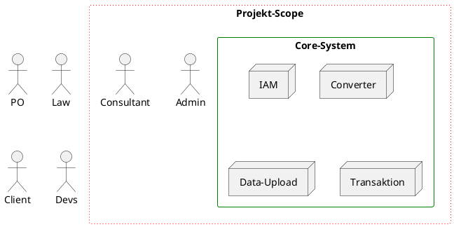

### Systemkontext
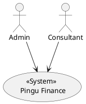

### Systemkontext detailiert
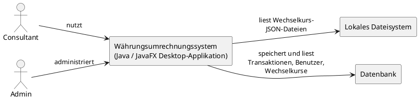
---

## Anforderungen
In der [Software Requirements Specification](/docs/srs.md) sind alle Funktionalen- sowie Nicht-Funktionalen Eigenschaften zusammengefasst.
---

## Use Cases
### Business Use Case
| **Name**  | Geldtransaktionsverwaltung |
| --- | --- |
| **Kurzbeschreibung**  | Die Geldtransaktionsverwaltung ermöglicht Consultants, sämtliche Währungs-Transaktionen ihrer Kunden vollständig, nachvollziehbar und zentral zu erfassen, zu bearbeiten und zu überwachen. Dadurch erhalten sie jederzeit Klarheit über vergangene Vorgänge, offene Transaktionen und relevante Kennzahlen zur Beratung und Auswertung. |
| **Auslöser** | Anruf entgegennehmen |
| **Ergebnis** | Transaktionsdurchführung |
| **Akteure** | Consultant, Kunde (Anrufer) |
---

## UC-01: Benutzer anmelden

**Akteur:** Consultant, Admin

**Vorbedingung:** Benutzer ist im System angelegt

**Nachbedingung:** Benutzer ist authentifiziert und autorisiert

**Ablauf:**

1. Benutzer gibt Benutzername und Passwort ein.
2. System prüft die Zugangsdaten.
3. System ermittelt die Benutzerrolle.
4. System gewährt Zugriff auf erlaubte Funktionen.

**Alternativabläufe:**

- Ungültige Zugangsdaten → Fehlermeldung
- Zu viele Fehlversuche → temporäre Sperre

---

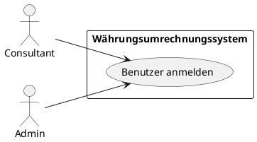

---

## UC-02: Wechselkurse hochladen

**Akteur:** Admin

**Vorbedingung:** Admin ist angemeldet

**Nachbedingung:** Neue Wechselkursversion ist aktiv

**Ablauf:**

1. Admin wählt eine JSON-Datei mit Wechselkursen aus.
2. System validiert Struktur und Inhalte.
3. System speichert die Wechselkurse versioniert.
4. System aktiviert die neue Wechselkursversion.

**Alternativabläufe:**

- Ungültige JSON-Struktur → Upload wird abgelehnt
- Fachlich inkonsistente Daten → Upload wird abgelehnt

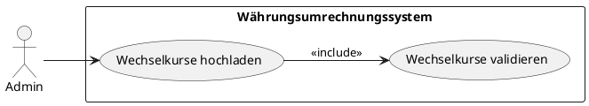

---

## UC-03: Währungsumrechnung durchführen

**Akteur:** Consultant

**Vorbedingung:** Gültige Wechselkurse sind vorhanden

**Nachbedingung:** Transaktion ist gespeichert

**Ablauf:**

1. Consultant gibt Betrag und Quellwährung ein.
2. Consultant wählt Zielwährung.
3. System berechnet den Zielbetrag.
4. System zeigt das Ergebnis an.
5. System persistiert die Umrechnung als Transaktion.

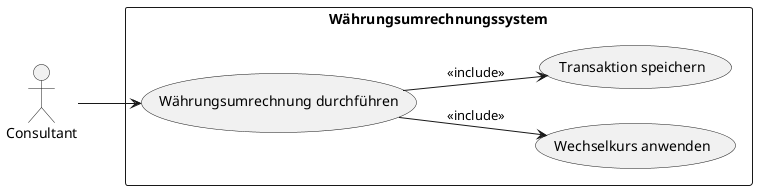

---

## UC-04: Transaktionen anzeigen und filtern

**Akteur:** Consultant, Admin

**Vorbedingung:** Benutzer ist angemeldet

**Nachbedingung:** Gefilterte Transaktionsliste wird angezeigt

**Ablauf:**

1. Benutzer öffnet die Transaktionsübersicht.
2. Benutzer setzt Filterkriterien (z. B. Datum, Währung, Status).
3. System lädt passende Transaktionen.
4. System stellt die Ergebnisse tabellarisch dar.

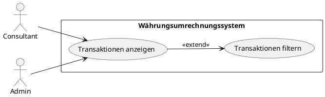

---

## UC-05: Transaktion revertieren

**Akteur:** Admin

**Vorbedingung:** Transaktion ist aktiv

**Nachbedingung:** Transaktion ist revertiert

**Ablauf:**

1. Admin wählt eine Transaktion aus.
2. Admin initiiert die Revertierung.
3. System fordert eine Begründung an.
4. Admin bestätigt.
5. System setzt Status auf `REVERTED` und protokolliert die Aktion.

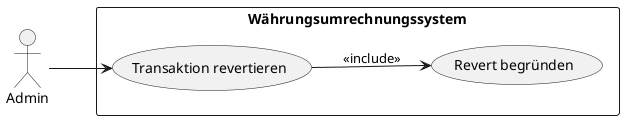

---

## UC-06: Wechselkurse anzeigen

**Akteur:** Consultant, Admin

**Vorbedingung:** Wechselkurse sind geladen

**Nachbedingung:** Wechselkursdaten werden angezeigt

**Ablauf:**

1. Benutzer öffnet die Wechselkursübersicht.
2. System zeigt Basiswährung, Zielwährungen und Kurse an.
3. System zeigt Versionsinformationen an.
---

## Fachklassen
### Overview
```plantuml
@startuml

' ──────────────────────────────────────
' CSS STYLING
' ──────────────────────────────────────
<style>
  element {
    FontName: "Segoe UI"
    FontSize: 13
  }

  root {
    BackgroundColor: #F8FAFC
    FontColor: #1E293B
  }

  classDiagram {
    class {
      BackgroundColor: #EFF6FF
      LineColor: #2563EB
      LineThickness: 2
      FontColor: #1E3A5F
      FontStyle: bold
      FontSize: 14
      RoundCorner: 10
      Shadowing: 4
    }

    .valueobject {
      BackgroundColor: #DCFCE7
      LineColor: #16A34A
      FontColor: #14532D
      RoundCorner: 12
    }

    .enumeration {
      BackgroundColor: #FFF7ED
      LineColor: #EA580C
      FontColor: #7C2D12
      RoundCorner: 8
    }

    arrow {
      LineColor: #64748B
      LineThickness: 1.5
      FontColor: #475569
      FontSize: 11
    }
  }

  legend {
    BackgroundColor: #F1F5F9
    LineColor: #CBD5E1
    FontSize: 11
    RoundCorner: 6
  }

  title {
    FontSize: 22
    FontStyle: bold
    FontColor: #0F172A
  }

  footer {
    FontSize: 10
    FontColor: #94A3B8
  }
</style>

' ──────────────────────────────────────
' LAYOUT
' ──────────────────────────────────────
skinparam linetype ortho
skinparam nodesep 200
skinparam ranksep 150

' ──────────────────────────────────────
' TITLE
' ──────────────────────────────────────
title Currency Exchange System\nFachklassenmodell (Übersicht)

' ──────────────────────────────────────
' ENUMERATIONS
' ──────────────────────────────────────
enum Role <<enumeration>>
enum TransactionState <<enumeration>>
enum Currency <<enumeration>>

' ──────────────────────────────────────
' VALUE OBJECTS
' ──────────────────────────────────────
class Name <<valueobject>>
class Password <<valueobject>>
class EmailAddress <<valueobject>>
class Amount <<valueobject>>

' ──────────────────────────────────────
' ENTITIES
' ──────────────────────────────────────
entity User <<entity>>
entity Client <<entity>>
entity Transaction <<entity>>

' ──────────────────────────────────────
' HIDDEN LAYOUT HELPERS
' ──────────────────────────────────────
User -[hidden]right- Client
Client -[hidden]right- Transaction
User -[hidden]down- Name
Transaction -[hidden]down- Amount
Transaction -[hidden]right- Currency

' ──────────────────────────────────────
' RELATIONSHIPS
' ──────────────────────────────────────

' User
User "1" --> "1" Role
User "1" *-right- "1" Name : firstname
User "1" *-down- "1" Name : lastname
User "1" *-down- "1" Password
User "1" *-down- "1" EmailAddress
User "1" -right- "many" Client : manages >

' Client
Client "1" *-down- "1" Name : firstname
Client "1" *-down- "1" Name : lastname

' Transaction
Transaction "many" -left- "1" User : madeBy >
Transaction "many" -left-> "1" Client : for
Transaction "1" *-down- "1" Amount : sourceAmount
Transaction "1" *-down- "1" Amount : targetAmount
Transaction "1" -right-> "1" Currency : sourceCurrency
Transaction "1" -right-> "1" Currency : targetCurrency
Transaction "1" -right-> "1" TransactionState

' ──────────────────────────────────────
' LEGEND
' ──────────────────────────────────────
legend bottom right
  |<#EFF6FF>    | Entity |
  |<#DCFCE7>    | Value Object |
  |<#FFF7ED>    | Enumeration |
  | **──▶** | Dependency |
  | **◆──** | Composition |
endlegend

footer Generated with PlantUML • Fachklassenmodell (abstrakt)

@enduml

```

### Im Detail
```plantuml
@startuml

' ──────────────────────────────────────
' CSS STYLING
' ──────────────────────────────────────
<style>
  element {
    FontName: "Segoe UI"
    FontSize: 12
  }

  root {
    BackgroundColor: #F8FAFC
    FontColor: #1E293B
  }

  classDiagram {
    class {
      BackgroundColor: #EFF6FF
      LineColor: #2563EB
      LineThickness: 2
      FontColor: #1E3A5F
      FontStyle: bold
      FontSize: 13
      RoundCorner: 10
      Shadowing: 4
    }

    .valueobject {
      BackgroundColor: #DCFCE7
      LineColor: #16A34A
      FontColor: #14532D
      RoundCorner: 12
    }

    .enumeration {
      BackgroundColor: #FFF7ED
      LineColor: #EA580C
      FontColor: #7C2D12
      RoundCorner: 8
    }

    arrow {
      LineColor: #64748B
      LineThickness: 1.5
      FontColor: #475569
      FontSize: 11
    }
  }

  package {
    BackgroundColor: #D7D7D7
    LineColor: #000
    LineThickness: 1.5
    FontColor: #334155
    FontStyle: bold
    RoundCorner: 8
  }

  legend {
    BackgroundColor: #F1F5F9
    LineColor: #CBD5E1
    FontSize: 11
    RoundCorner: 6
  }

  title {
    FontSize: 22
    FontStyle: bold
    FontColor: #0F172A
  }

  footer {
    FontSize: 10
    FontColor: #94A3B8
  }
</style>

' ──────────────────────────────────────
' LAYOUT OPTIMIZATIONS
' ──────────────────────────────────────

' Use polyline instead of ortho — ortho causes more overlapping
' and pushes labels far from arrows on complex diagrams
skinparam linetype ortho

' Increase spacing between nodes to give arrows room
skinparam nodesep 150
skinparam ranksep 250

' ──────────────────────────────────────
' TITLE
' ──────────────────────────────────────
title Currency Exchange System\nDomain Model — Class Diagram

' ──────────────────────────────────────
' ENUMERATIONS
' ──────────────────────────────────────
package "«enumerations»" {
  enum Role <<enumeration>> {
    ADMIN
    CONSULTANT
  }

  enum TransactionState <<enumeration>> {
    NOT_STARTED
    PENDING
    SUCCESSFUL
    FAILURE
  }

  enum Currency <<enumeration>> {
    USD
    EUR
    JPY
    GBP
    AUD
    CAD
    CHF
    CNH
    HKD
    NZD
  }
}

' ──────────────────────────────────────
' VALUE OBJECTS
' ──────────────────────────────────────
package "«value objects»" {
  class Name <<valueobject>> {
    -- properties --
    - String value
    -- methods --
    + validate(String value) : boolean
  }

  class Password <<valueobject>> {
    -- properties --
    - String value
    -- methods --
    + validate() : boolean
  }

  class EmailAddress <<valueobject>> {
    -- properties --
    - String value
    -- methods --
    + validate() : boolean
  }

  class Amount <<valueobject>> {
    -- properties --
    - Long value
    -- methods --
    + validate(Long value) : boolean
  }
}

' ──────────────────────────────────────
' ENTITIES
' ──────────────────────────────────────
package "«entities»" {
  entity User <<entity>> {
    -- properties --
    Instant createdAt
    -- methods --
    + User()
  }

  entity Client <<entity>> {
    -- properties --
    Instant clientSince
    -- methods --
    + Client()
  }

  entity Transaction <<entity>> {
    -- properties --
    Instant timestamp
    -- methods --
    + Transaction()
  }
}

' ──────────────────────────────────────
' HIDDEN LAYOUT HELPERS
' ──────────────────────────────────────
' These invisible arrows influence element placement
' without appearing in the diagram

' Keep entities in a logical row
User -[hidden]right- Client
Client -[hidden]right- Transaction

' Keep value objects grouped below entities
User -[hidden]down- Name
Transaction -[hidden]down- Amount

' Keep enums on the right side
Transaction -[hidden]right- Currency

' ──────────────────────────────────────
' RELATIONSHIPS
' ──────────────────────────────────────

' User relationships
User "1" --> "1" Role : has
User "1" *-down- "1" Name : firstname
User "1" *-down- "1" Name : lastname
User "1" *-down- "1" Password : has
User "1" *-down- "1" EmailAddress : has
User "1" -right- "many" Client : manages >

' Client relationships
Client "1" *-down- "1" Name : firstname
Client "1" *-down- "1" Name : lastname

' Transaction relationships
Transaction "many" -left- "1" User : madeBy >
Transaction "many" -left- "1" Client : for >
Transaction "1" *-down- "1" Amount : sourceAmount
Transaction "1" *-down- "1" Amount : targetAmount
Transaction "1" -right-> "1" Currency : sourceCurrency
Transaction "1" -right-> "1" Currency : targetCurrency
Transaction "1" -right-> "1" TransactionState : has

' ──────────────────────────────────────
' LEGEND
' ──────────────────────────────────────
legend bottom right
  |<#EFF6FF>    | Entity |
  |<#DCFCE7>    | Value Object |
  |<#FFF7ED>    | Enumeration |
  | **──▶** | Dependency |
  | **◆──** | Composition |
endlegend

footer Generated with PlantUML • Domain-Driven Design

@enduml
```
